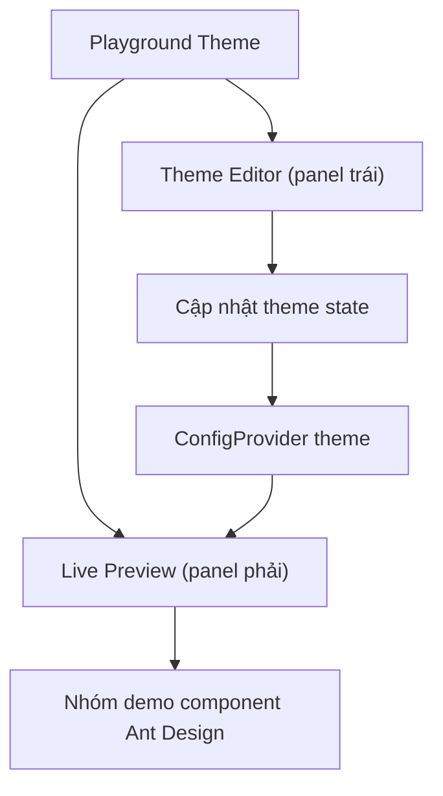

## 1. Product Overview
Theme Playground là một ứng dụng demo giúp bạn chỉnh theme Ant Design ở panel trái và xem preview cập nhật realtime ở panel phải thông qua ConfigProvider.
Mục tiêu: cung cấp một “sân chơi” trực quan để kiểm tra token/theme và hành vi UI trên nhiều component phổ biến.

## 2. Core Features

### 2.1 Feature Module
Ứng dụng gồm các trang chính sau:
1. **Playground Theme**: layout 2 cột (trái chỉnh theme, phải preview realtime), khu vực demo 15–20 component Ant Design được nhóm theo mục.

### 2.3 Page Details
| Page Name | Module Name | Feature description |
|-----------|-------------|------------------|
| Playground Theme | App Shell | Hiển thị header (tên app), bố cục 2 panel (trái/phải), desktop-first. |
| Playground Theme | Theme Editor (panel trái) | Chỉnh các cấu hình theme (token/algorithm) và cập nhật ngay lên UI thông qua ConfigProvider. |
| Playground Theme | Live Preview (panel phải) | Render toàn bộ khu vực demo component bên trong ConfigProvider để phản ánh theme hiện tại theo thời gian thực. |
| Playground Theme | Component Demos (theo nhóm) | Hiển thị 15–20 component Ant Design mẫu, chia nhóm rõ ràng và thống nhất style demo để dễ so sánh. |

## 3. Core Process
**Luồng người dùng (single flow):**
1) Bạn mở Playground.
2) Bạn thay đổi thông số theme ở panel trái.
3) Ứng dụng cập nhật cấu hình theme cho ConfigProvider.
4) Panel phải re-render và bạn quan sát sự thay đổi trên các nhóm component demo.

