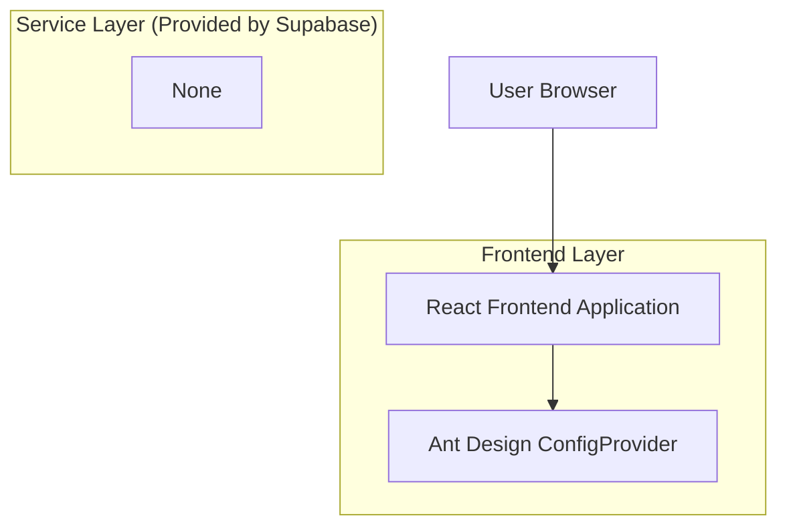

## 1.Architecture design

## 2.Technology Description
- Frontend: React@18 + TypeScript + Ant Design@5 + vite
- Backend: None

## 3.Route definitions
| Route | Purpose |
|-------|---------|
| / | Trang Playground: chỉnh theme bên trái, preview realtime bên phải, demo component theo nhóm |

## 6.Data model(if applicable)
Không có cơ sở dữ liệu trong phạm vi MVP.